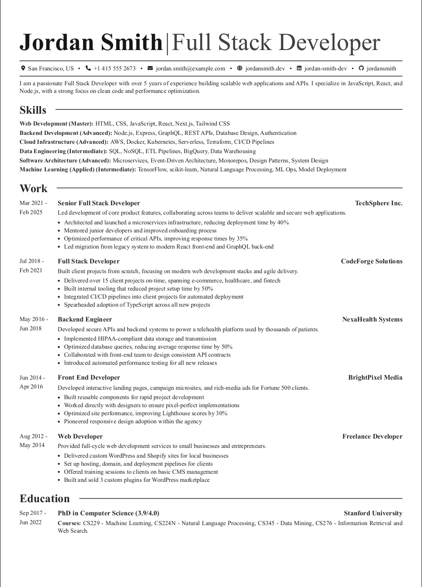
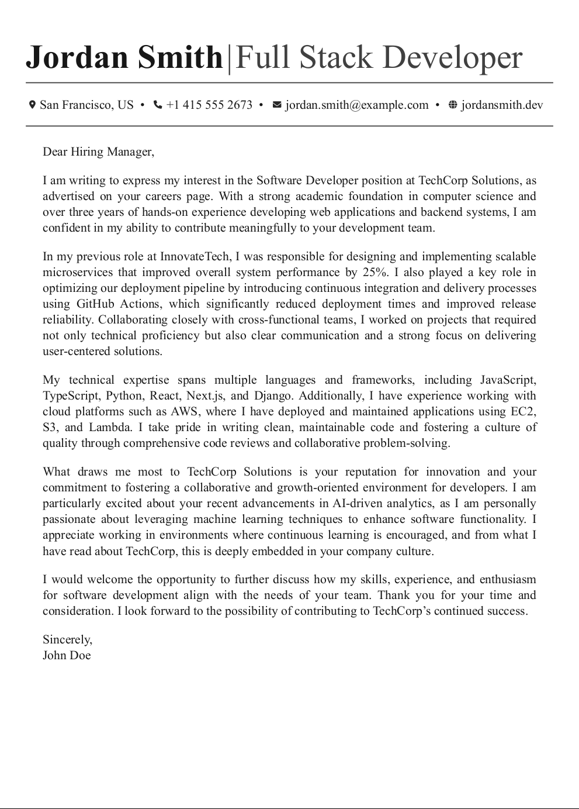

Here's an improved and more polished version of your **README.md** for the Lazy Resume Theme, with better structure, clearer explanations, and embedded references to `./public/resume.pdf` and `./public/resume-cover.pdf`. It also includes side-by-side previews for the resume and cover letter images.

---

# Lazy Resume Theme for `jsonresume` Format

A simple, clean theme for resumes and cover letters using the `jsonresume` format.

---

## QuickStart

Clone the repository and install dependencies:

```bash
git clone git@github.com:tudorjnu/jsonresume-theme-lazy.git
cd jsonresume-theme-lazy
npm install
```

---

## Generate Your Resume

This theme includes a sample `resume.json` and `cover.md` to help you get started quickly.

### Export Resume (PDF)

To generate a resume PDF, run:

```bash
npm run export-resume ./resume.json resume.pdf
```

**Arguments:**

```bash
npm run export-resume <path-to-resume.json> [output-path]
```

---

## Generate Your Cover Letter

To generate a cover letter PDF, run:

```bash
npm run export-cover render_cover.js ./resume.json ./cover.md cover.pdf
```

**Arguments:**

```bash
npm run export-cover render_cover.js <path-to-resume.json> <path-to-cover.md> [output-path]
```

---

## Example Outputs

### Resume & Cover Letter (Previews)

Here’s how the default resume and cover letter look when rendered using this theme:

| Resume                               | Cover Letter                          |
|--------------------------------------|--------------------------------------|
|  |  |

### PDF Outputs

For reference, you can also check the actual generated PDFs:

- [Resume PDF](./public/resume.pdf)
- [Cover Letter PDF](./public/resume-cover.pdf)

---

## Contribute

If you like the theme, consider leaving a ⭐️! Contributions are very much welcome.

---

## TODOs

- [ ] Add a CLI tool to quickly generate resumes and cover letters.
- [ ] Improve integration with `resume-cli` and `resumed`.
- [ ] Ensure consistent styles across the resume and cover letter.
- [ ] Fix issues with inconsistent sizing and layout in PDF exports.

---

Let me know if you want this formatted as a new `README.md` file you can copy-paste directly!
